# MicroLIMS Entity Relationship Diagram

Generated directly against `backend/MicroLIMS.Domain/Entities/*.cs` — this
is the authoritative schema; if it drifts from the code, the code wins
and this file should be regenerated.

```mermaid
erDiagram
    %% ---- Identity & Security ----
    ROLE ||--o{ USER : "has"
    ROLE ||--o{ ROLE_PERMISSION : "granted"
    PERMISSION ||--o{ ROLE_PERMISSION : "granted to"
    USER ||--o{ LOGIN_HISTORY : "attempts"
    USER ||--o{ REFRESH_TOKEN : "issued"
    USER ||--o{ PASSWORD_RESET_TOKEN : "requested"
    USER ||--o{ NOTIFICATION_LOG : "receives"

    ROLE {
        int Id PK
        string Type "RoleType enum"
        string Name
    }
    PERMISSION {
        int Id PK
        string Code
        string Description
    }
    ROLE_PERMISSION {
        int Id PK
        int RoleId FK
        int PermissionId FK
    }
    USER {
        int Id PK
        string FullName
        string Username
        string PasswordHash
        int RoleId FK
        bool IsActive
        int FailedLoginAttempts
        datetime LockedUntil
        datetime CreatedAt
    }
    LOGIN_HISTORY {
        int Id PK
        int UserId FK
        string Username
        bool Success
        string FailureReason
        string IpAddress
        datetime Timestamp
    }
    REFRESH_TOKEN {
        int Id PK
        int UserId FK
        string TokenHash
        datetime ExpiresAt
        datetime RevokedAt
    }
    PASSWORD_RESET_TOKEN {
        int Id PK
        int UserId FK
        string TokenHash
        datetime ExpiresAt
        datetime UsedAt
    }
    NOTIFICATION_LOG {
        int Id PK
        int UserId FK
        string Type
        string Message
        string Severity
        bool IsRead
        bool EmailSent
        datetime CreatedAt
    }

    %% ---- Master Configuration (Item / Product domain) ----
    ITEM ||--o{ SAMPLE_TEST : "assigned tests"
    ITEM ||--o{ SPECIFICATION : "limits"
    ITEM ||--o{ SAMPLE : "received as"

    ITEM {
        int Id PK
        string Name
        string Code
        string Category "SampleCategory enum"
    }
    SAMPLE_TEST {
        int Id PK
        string TestCode
        string DisplayName
        int ItemId FK
    }
    SPECIFICATION {
        int Id PK
        int ItemId FK
        string TestCode
        string AlertLimit
        string ActionLimit
        string SpecLimit
    }

    %% ---- Sample Receiving -> Test Orders ----
    SAMPLE ||--o{ TEST_ORDER : "generates"
    TEST_ORDER ||--o{ RESULT : "results"
    TEST_ORDER ||--o{ INCUBATION : "incubation steps"
    TEST_ORDER ||--o{ WORKFLOW_HISTORY : "state transitions"
    TEST_ORDER ||--o{ PATHOGEN_OBSERVATION : "chain steps"
    TEST_ORDER ||--o{ MEDIA_USAGE : "media used"

    SAMPLE {
        int Id PK
        int ItemId FK
        string BatchNumber
        string ContainerNumber
        string Cause
        datetime ReceivedAt
        string Status "SampleStatus enum"
    }
    TEST_ORDER {
        int Id PK
        int SampleId FK
        string TestCode
        string Status "ApprovalStatus enum"
        string CurrentStep "WorkflowStep enum"
        int AssignedAnalystId FK
    }
    RESULT {
        int Id PK
        int TestOrderId FK
        string RawValue
        string InterpretedValue
        string Type "ResultType enum"
        int EnteredByUserId FK
        datetime EnteredAt
    }
    INCUBATION {
        int Id PK
        int TestOrderId FK
        int StepNumber
        string StepName
        datetime StartedAt
        datetime CompletedAt
        string Outcome
    }
    WORKFLOW_HISTORY {
        int Id PK
        int TestOrderId FK
        string FromStep "WorkflowStep enum"
        string ToStep "WorkflowStep enum"
        string Note
        int PerformedByUserId FK
        datetime Timestamp
    }
    PATHOGEN_OBSERVATION {
        int Id PK
        int TestOrderId FK
        string StepName "TSB / RVS / XLD_TSI / Simple"
        int StepOrder
        bool GrowthObserved
        int ObservedByUserId FK
        datetime ObservedAt
    }

    %% ---- Water domain ----
    WATER_SAMPLING_POINT ||--o{ SAMPLING_CONFIGURATION : "test limits"
    WATER_SAMPLING_POINT {
        int Id PK
        string Code
        string Location
        string AssignedTestCodes "list"
    }
    SAMPLING_CONFIGURATION {
        int Id PK
        int WaterSamplingPointId FK
        string TestCode
        string AlertLimit
        string ActionLimit
        string SpecLimit
    }

    %% ---- EM domain ----
    DEPARTMENT ||--o{ ROOM : "contains"
    ROOM ||--o{ EM_ROOM : "sampling positions"
    ROOM ||--o{ ROOM_MONITORING : "monitored"
    TEST_ORDER ||--o| ROOM_MONITORING : "produces"

    DEPARTMENT {
        int Id PK
        string Name
    }
    ROOM {
        int Id PK
        string Name
        int DepartmentId FK
        string GradeClassification "A/B/C/D"
    }
    EM_ROOM {
        int Id PK
        int RoomId FK
        string SamplingPositions "list"
    }
    ROOM_MONITORING {
        int Id PK
        int RoomId FK
        string SamplingPosition
        int TestOrderId FK
        int Step1Count
        int Step2Count
        bool IsOutOfTrend
        datetime SampledAt
    }

    %% ---- After Cleaning domain ----
    MACHINE ||--o{ MACHINE_PART : "has parts"
    MACHINE_PART ||--o{ MACHINE_PART_CONFIGURATION : "test config"

    MACHINE {
        int Id PK
        string Name
    }
    MACHINE_PART {
        int Id PK
        int MachineId FK
        string Name
    }
    MACHINE_PART_CONFIGURATION {
        int Id PK
        int MachinePartId FK
        string TestCode
        bool IsCollectivePathogenSample
    }

    %% ---- Media / GPT domain ----
    MEDIA ||--o{ GPT_CHALLENGE_RESULT : "challenge results"
    MEDIA ||--o{ MEDIA_USAGE : "used in"

    MEDIA {
        int Id PK
        string Name
        string LotNumber
        datetime ExpiryDate
        string Status "MediaStatus enum"
        string GptStage "GptStage enum"
    }
    GPT_CHALLENGE_RESULT {
        int Id PK
        int MediaId FK
        string OrganismName
        bool Passed
        int RecordedByUserId FK
        datetime RecordedAt
    }
    MEDIA_USAGE {
        int Id PK
        int MediaId FK
        int TestOrderId FK
        datetime UsedAt
        int UsedByUserId FK
    }

    %% ---- Reference Strains ----
    REFERENCE_STRAIN ||--o{ CRYOVIAL : "vials"
    CRYOVIAL ||--o{ PASSAGE_EVENT : "passage history"

    REFERENCE_STRAIN {
        int Id PK
        string OrganismName
        string AtccNumber
        string Source
    }
    CRYOVIAL {
        int Id PK
        int ReferenceStrainId FK
        string VialNumber
        int PassageNumber
        datetime ReceivedDate
        datetime ExpiryDate
        bool IsDestroyed
    }
    PASSAGE_EVENT {
        int Id PK
        int CryovialId FK
        int PassageNumber
        datetime PerformedAt
        int PerformedByUserId FK
        string Notes
    }

    %% ---- Reporting & Audit ----
    REPORT ||--o{ REPORT_SNAPSHOT : "frozen data"

    REPORT {
        int Id PK
        string Category "SampleCategory enum"
        string Title
        datetime GeneratedAt
        int GeneratedByUserId FK
        string PdfPath
    }
    REPORT_SNAPSHOT {
        int Id PK
        int ReportId FK
        string Category
        string DataJson
        datetime CapturedAt
    }
    AUDIT_LOG {
        int Id PK
        string EntityName
        string EntityId
        string Action
        string PreviousValue
        string NewValue
        int UserId FK
        datetime Timestamp
    }
```

## Notes

- `AUDIT_LOG` is populated automatically by `MicroLimsDbContext.SaveChanges`
  for every insert/update/delete on any tracked entity — it has no
  direct foreign key relationships drawn above because it references
  entities generically by `EntityName` + `EntityId`.
- `WORKFLOW_HISTORY` is the single source of truth for "workflow history"
  shown in Review/Approval screens — every state transition, including
  approval decisions, is recorded here by `WorkflowStateMachine.TransitionAsync`.
- Enum-typed columns (`Status`, `Category`, `Type`, etc.) are serialized
  as **strings over the API** (see `JsonStringEnumConverter` in
  `Program.cs`), but EF Core stores them as their underlying **int**
  value in PostgreSQL by default. If human-readable values in the
  database are wanted (recommended for ad-hoc SQL/reporting), add
  `.HasConversion<string>()` to each enum property in the relevant
  `IEntityTypeConfiguration<T>` class before the first migration.
