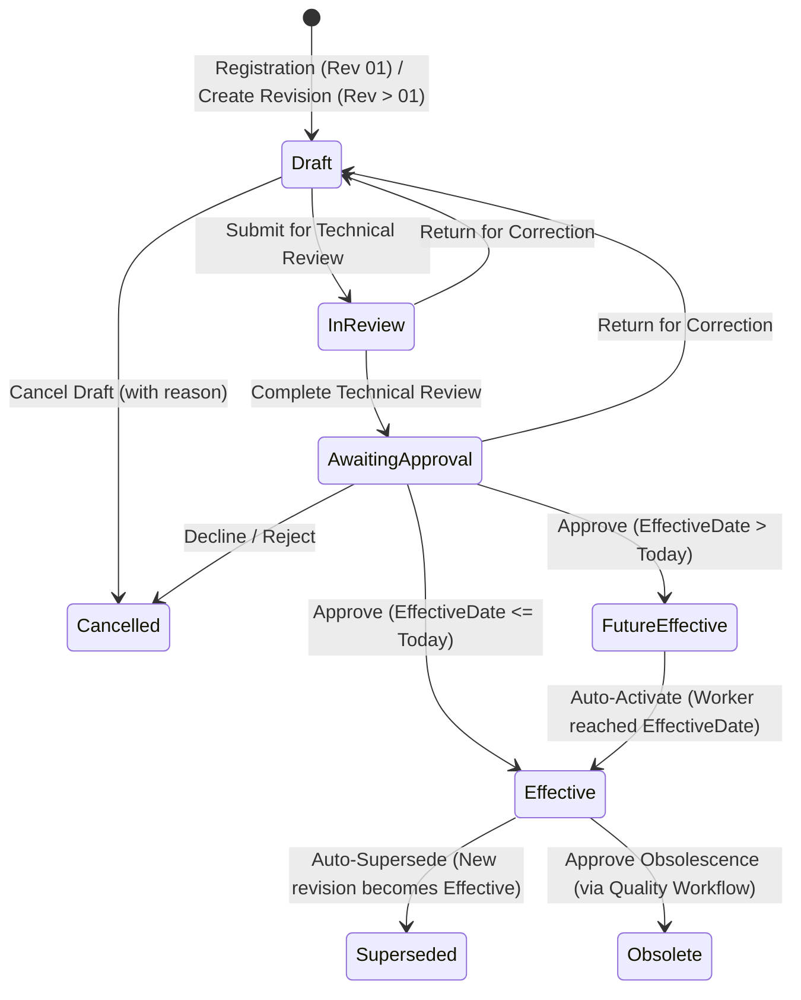

# Functional Requirements Specification (FRS) — Release 1b

**Document Number:** ML-DC-FRS-1B-001  
**Title:** MicroLIMS Document Control Module — Functional Requirements Specification (Release 1b)  
**Version:** 1.0  
**Status:** Approved Baseline  
**Release Scope:** Release 1b — Technical Review, Revision Creation & Incrementation, Approval Workflow, 21 CFR Part 11 Electronic Signature, Effective Date Automation, Periodic Review  
**Applicable Regulations:** GAMP 5, US FDA 21 CFR Part 11, EU Annex 11, ALCOA+ Principles  
**Authoritative Baseline:** MicroLIMS Document Control URS v1.1 (43 Deferred Requirements: `DC-URS-044` through `DC-URS-079`, `DC-URS-177` through `DC-URS-183`, plus SoD Rules `DC-URS-164` through `DC-URS-169`)  
**Effective Date:** September 3, 2026  

---

## 1. Governance & Control

### 1.1 Revision History
| Version | Date | Author | Description of Change |
|---|---|---|---|
| 0.1 | 03-Sep-2026 | Validation & Architecture Team | Initial Draft FRS for Release 1b derived directly from URS v1.1. |
| 1.0 | 03-Sep-2026 | Lead Architect & CSV Specialist | Approved Baseline v1.0 following technical baseline analysis. |

### 1.2 Sign-off & Controlled Approvals
| Role | Title | Verification Mandate |
|---|---|---|
| **Author** | Lead Software Architect | Technical architecture, entity design & API integrity |
| **System Owner** | QC Microbiology Laboratory Director | Operational laboratory suitability & workflow alignment |
| **Quality Assurance** | Head of QA & Compliance | 21 CFR Part 11, Annex 11, and ALCOA+ data integrity compliance |
| **Technical Reviewer**| IT Technical Specialist | Persistence, background worker, security & infrastructure alignment |

---

## 2. Release 1b Scope & Functional Architecture

### 2.1 Scope Overview
Release 1b activates the formal document review, revision, approval, and automated lifecycle governance of the MicroLIMS Document Control module. It builds directly upon the qualified Release 1a persistence, cryptographic, and audit foundation.

The 43 requirements of Release 1b are organized into four core functional domains:
1. **Periodic Review Management (`DC-URS-044` through `DC-URS-054`, `DC-URS-179`):** Automatic review task scheduling based on review cycle, independent review history, review findings, and outcomes (`RemainsValid`, `RevisionRequired`, `ObsolescenceRecommended`).
2. **Revision Control & Incrementation (`DC-URS-055` through `DC-URS-065`):** Controlled revision creation from effective documents, preservation of master identity, major/minor numbering, change summaries, change reference (Change Control tracking), impact assessment, and required-change tracking.
3. **Technical Review & Approval Workflow (`DC-URS-066` through `DC-URS-079`):** Controlled technical review with page/section findings and comment lifecycles, reviewer verification gates, formal approval routing, and mandatory 21 CFR Part 11 electronic signatures with re-authentication.
4. **Effective Date Control & Automation (`DC-URS-177`, `DC-URS-178`, `DC-URS-180` through `DC-URS-183`):** Idempotent background worker service (`DocumentEffectiveDateWorker`) executing automatic transition of `FutureEffective` revisions to `Effective`, automatic superseding of prior revisions, downtime recovery, and system-attributed audit logging.
5. **Enforcing Segregation of Duties (`DC-URS-164` through `DC-URS-169`):** Mandatory server-side enforcement that for any given revision: **AUTHOR ≠ REVIEWER ≠ APPROVER**.

---

## 3. Detailed Functional Requirements Specification

The following specifications define the functional behavior, actors, preconditions, inputs, processing logic, status transitions, audit requirements, SoD rules, error handling, acceptance criteria, and verification methods for every Release 1b requirement.

---

### 3.1 Domain 1: Periodic Review Management

#### FS-1b-044: Automated Periodic Review Task Creation (`DC-URS-044`)
- **Functional Behavior:** The system shall automatically generate a `PeriodicReviewTask` when a document's `NextReviewDate` is approached (e.g. 30 days prior) or reached.
- **Actors / Roles:** System Scheduler (Automated Worker); Document Owner; Document Controller.
- **Preconditions:** Document Master holds an active revision in `Effective` status with a populated `NextReviewDate`.
- **Inputs:** Current UTC date from system clock; document review cycle parameters.
- **Processing Logic:**
  1. `DocumentEffectiveDateWorker` scans all `DocumentRevisions` where `RevisionStatus == Effective` and `NextReviewDate <= UtcNow.AddDays(AdvanceNoticeDays)`.
  2. If no open `PeriodicReviewTask` exists for the revision, system creates a new `PeriodicReviewTask` in status `Pending`.
  3. Task due date is set to `NextReviewDate`; assigned reviewer defaults to the Document Master's designated Document Owner or active `TechnicalReviewer`.
- **Outputs:** Persisted `PeriodicReviewTask` record; dashboard notification indicator.
- **Status Transitions:** Review task initialized to `Pending`.
- **Audit Requirements:** Logged via `AuditEventService` with `ActionCode = "PeriodicReviewTaskCreated"`, attributed to `ActorType.System`.
- **Authorization & SoD:** System-triggered; access restricted to assigned reviewer, Owner, and Controller.
- **Error Handling:** If database insert fails, error is logged and process retries on next scheduled run.
- **Acceptance Criteria:** Task is created exactly once per review cycle without duplicate open tasks.
- **Verification Method:** OQ Automated Test / Integration Test.

#### FS-1b-045: Periodic Review Inspection Workspace (`DC-URS-045`)
- **Functional Behavior:** The Periodic Review workspace shall present the current effective controlled PDF alongside document metadata, revision history, and prior review findings.
- **Actors / Roles:** Designated Reviewer; Document Owner; Document Controller.
- **Preconditions:** User is authenticated and assigned to the periodic review task.
- **Inputs:** `PeriodicReviewTaskId`.
- **Processing Logic:** System verifies user authorization and returns the review bundle, including the verified controlled PDF stream, current metadata, review cycle history, and open review findings.
- **Outputs:** Rendered Review Workspace with PDF viewer and review action toolbar.
- **Audit Requirements:** Read access logged per controlled copy policy if configured.
- **Acceptance Criteria:** Reviewer can inspect the authentic, SHA-256 verified PDF within the review workspace.
- **Verification Method:** UI / OQ Test.

#### FS-1b-046: Page and Section Specific Review Notes (`DC-URS-046`)
- **Functional Behavior:** The reviewer shall be able to record structured review notes linked to a specific page and/or section number.
- **Actors / Roles:** Designated Reviewer.
- **Preconditions:** Review task is in `Pending` or `InProgress` status.
- **Inputs:** `PageNumber` (optional integer), `SectionNumber` (optional string), `NoteText` (mandatory string >= 5 chars).
- **Processing Logic:** Validates inputs and persists a `PeriodicReviewFinding` linked to the task. Updates task status to `InProgress`.
- **Outputs:** Persisted `PeriodicReviewFinding` record.
- **Audit Requirements:** `ActionCode = "PeriodicReviewNoteAdded"`.
- **Acceptance Criteria:** Notes accurately store page/section anchors and are displayed in the review workspace.
- **Verification Method:** Unit / Integration Test.

#### FS-1b-047 & FS-1b-048: Periodic Review Outcome Determination (`DC-URS-047`, `DC-URS-048`)
- **Functional Behavior:** The reviewer shall conclude the review by selecting one of three mandatory outcomes: `RemainsValid`, `RevisionRequired`, or `ObsolescenceRecommended`. Selecting `RemainsValid` shall NOT create a new revision.
- **Actors / Roles:** Designated Reviewer.
- **Preconditions:** Review task is `InProgress`; mandatory review questions completed.
- **Inputs:** `Outcome` (`RemainsValid` | `RevisionRequired` | `ObsolescenceRecommended`), `SummaryComments` (mandatory >= 10 chars).
- **Processing Logic:**
  1. If `RemainsValid`: Task status set to `Completed`. Document revision status remains `Effective`. No new revision is initiated.
  2. If `RevisionRequired`: Task status set to `CompletedWithChangesRequired`. Initiating a new revision is unlocked.
  3. If `ObsolescenceRecommended`: Task status set to `ObsolescenceProposed`. Triggers obsolescence approval workflow.
- **Outputs:** Completed `PeriodicReviewTask` record with recorded outcome and timestamp.
- **Audit Requirements:** `ActionCode = "PeriodicReviewCompleted"`, capturing outcome, notes, and reviewer ID.
- **Acceptance Criteria:** `RemainsValid` closes review without altering revision sequence or status.
- **Verification Method:** OQ Automated Test.

#### FS-1b-049: Next Review Date Recalculation on Remains Valid (`DC-URS-049`)
- **Functional Behavior:** Upon a `RemainsValid` completion, the system shall record an immutable review history entry and automatically calculate and advance the `NextReviewDate`.
- **Actors / Roles:** Designated Reviewer; System.
- **Preconditions:** Review concluded with `Outcome == RemainsValid`.
- **Inputs:** `ReviewCycleMonths` from revision or document type.
- **Processing Logic:**
  1. `NextReviewDate` is calculated as `TaskCompletedDate.AddMonths(ReviewCycleMonths)`.
  2. Updated `NextReviewDate` is persisted to `DocumentRevision`.
  3. Field diff captured in `AuditEventChanges`.
- **Outputs:** Updated `DocumentRevision.NextReviewDate`.
- **Audit Requirements:** `ActionCode = "NextReviewDateAdvanced"`, recording old and new dates.
- **Acceptance Criteria:** Next review date advanced exactly by review cycle months in UTC.
- **Verification Method:** Unit / Integration Test.

#### FS-1b-050 & FS-1b-051: Revision Required Outcome and Finding Transfer (`DC-URS-050`, `DC-URS-051`)
- **Functional Behavior:** When `RevisionRequired` is selected, the system shall permit initiating a new revision linked to the periodic review and transfer recorded findings into the new revision as required change items.
- **Actors / Roles:** Document Owner; Document Author.
- **Preconditions:** Periodic review concluded with `RevisionRequired`.
- **Inputs:** `OriginatingPeriodicReviewTaskId`.
- **Processing Logic:**
  1. Unlocks "Create Revision" action referencing the review task.
  2. Copies all `PeriodicReviewFinding` records from the review task into `RevisionChangeItem` records attached to the new draft revision, marked as `Source = PeriodicReview`.
- **Outputs:** New draft revision linked to `OriginatingPeriodicReviewTaskId` with pre-populated change items.
- **Audit Requirements:** `ActionCode = "RevisionCreatedFromPeriodicReview"`.
- **Acceptance Criteria:** All review findings are traceable within the draft revision.
- **Verification Method:** OQ Automated Test.

#### FS-1b-052: Obsolescence Recommendation Governance (`DC-URS-052`)
- **Functional Behavior:** A recommendation for obsolescence shall require formal approval before the document can transition to `Obsolete`.
- **Actors / Roles:** Document Controller; QA Approver.
- **Preconditions:** Periodic review concluded with `ObsolescenceRecommended`.
- **Inputs:** Formal justification; approval sign-off.
- **Processing Logic:** An obsolescence approval task is created. The document remains in `Effective` status until the obsolescence approval workflow is successfully executed and signed.
- **Outputs:** `DocumentApprovalTask` with `TargetStatus = Obsolete`.
- **Audit Requirements:** `ActionCode = "ObsolescenceRecommended"`.
- **Acceptance Criteria:** Document cannot be marked obsolete directly by the reviewer without quality approval.
- **Verification Method:** OQ Automated Test.

#### FS-1b-053: Independent Maintenance of Periodic Review History (`DC-URS-053`)
- **Functional Behavior:** Periodic review history records shall be stored in a dedicated relational entity (`PeriodicReviewTask`) and maintained independently from document revision records.
- **Actors / Roles:** All authorized viewers.
- **Processing Logic:** Document details displays a dedicated **Periodic Review** tab listing all historical review rounds across all revisions of the Document Master.
- **Acceptance Criteria:** Review history is preserved across subsequent revisions.
- **Verification Method:** Integration Test / UI Test.

#### FS-1b-054: Overdue Periodic Review Identification (`DC-URS-054`)
- **Functional Behavior:** The system shall identify documents whose `NextReviewDate < UtcNow` as `Overdue` on dashboards, library filters, and reports.
- **Actors / Roles:** All users.
- **Processing Logic:** Library queries and dashboard KPIs compute `IsReviewOverdue = (Status == Effective && NextReviewDate < UtcNow)`. Visual alerts display warning badges.
- **Acceptance Criteria:** Overdue documents are highlighted with high-visibility badges and filterable in library.
- **Verification Method:** Unit / UI Test.

---

### 3.2 Domain 2: Revision Creation & Incrementation

#### FS-1b-055 & FS-1b-056: Revision Creation from Effective Document (`DC-URS-055`, `DC-URS-056`)
- **Functional Behavior:** Authorized users shall be able to create a new draft revision from an currently effective document, retaining the permanent `DocumentMasterId` and `MicroLimsDocumentId`.
- **Actors / Roles:** Document Owner; Assigned Author; Document Controller.
- **Preconditions:** Document Master holds an `Effective` revision; no open `Draft`, `InReview`, or `AwaitingApproval` revision currently exists for the master.
- **Inputs:** `ReasonForRevision` (mandatory string >= 10 chars), `RevisionType` (`Major` | `Minor`), `ChangeReference` (optional string).
- **Processing Logic:**
  1. Verifies that master has no active draft or workflow revision (only one revision in workflow permitted at a time).
  2. Allocates next `RevisionSequence = CurrentEffective.RevisionSequence + 1`.
  3. Creates new `DocumentRevision` in status `Draft`.
- **Outputs:** Persisted draft `DocumentRevision` record.
- **Audit Requirements:** `ActionCode = "DocumentRevisionCreated"`.
- **Authorization & SoD:** Must be Document Owner, assigned Author, or Document Controller.
- **Error Handling:** Rejects request if another revision is already in draft or workflow (`InvalidOperationException`).
- **Acceptance Criteria:** Master retains identity; prior effective revision remains effective; new revision initialized in Draft.
- **Verification Method:** OQ Automated Test.

#### FS-1b-057: Proposed Revision Numbering & Override Control (`DC-URS-057`, `DC-URS-060`)
- **Functional Behavior:** The system shall automatically propose the next revision number based on `RevisionType` (`Major` -> `02`, `03` or `Minor` -> `01.1`, `01.2`), while allowing authorized Document Controllers to adjust it where company numbering rules require it.
- **Actors / Roles:** System (Proposer); Document Controller (Adjuster).
- **Inputs:** `RevisionType`, optional `CustomRevisionNumber`.
- **Processing Logic:**
  1. Default: If `Major`, increments integer string (`01` -> `02`). If `Minor`, appends sub-version (`01.1`).
  2. If custom override provided: User must hold `SectionHead` (Document Controller) role; format validated against regex.
- **Audit Requirements:** If overridden, logs `ActionCode = "RevisionNumberOverridden"`, capturing reason.
- **Acceptance Criteria:** Standard increments automated; overrides restricted to Controller and audited.
- **Verification Method:** Unit / Integration Test.

#### FS-1b-058 & FS-1b-059: Change Reason, Change Summary, and Change Reference (`DC-URS-058`, `DC-URS-059`)
- **Functional Behavior:** Each revision shall record a mandatory Reason for Revision, Change Summary, and optional Change Reference (e.g. Change Control ticket `CC-2026-XXXX`).
- **Inputs:** `ReasonForRevision` (string >= 10 chars), `ChangeSummary` (string >= 10 chars), `ChangeReference` (string <= 100 chars).
- **Processing Logic:** Validated by FluentValidation on revision creation and draft update.
- **Acceptance Criteria:** Incomplete or whitespace-only reasons are rejected.
- **Verification Method:** Unit Test.

#### FS-1b-061: Structured Affected Section and Change Items (`DC-URS-061`)
- **Functional Behavior:** Revisions shall support structured affected section change items, detailing what section changed, before/after descriptions, and rationale.
- **Inputs:** `SectionNumber`, `SectionTitle`, `DescriptionOfChange`, `ChangeRationale`.
- **Processing Logic:** Stored in relational entity `RevisionChangeItem` linked to the `DocumentRevision`.
- **Acceptance Criteria:** Authors can add, update, or remove structured change items during draft stage.
- **Verification Method:** Unit / UI Test.

#### FS-1b-062: Multi-Category Revision Impact Assessment (`DC-URS-062`)
- **Functional Behavior:** The author shall complete a structured impact assessment across defined categories: Procedure/Method, Training, Forms/Templates, Specifications, Equipment, Materials/Media, Validation, Regulatory Commitment, and Related Documents.
- **Inputs:** Key-value pairs for each category: `HasImpact` (boolean), `ImpactDetails` (string required if `HasImpact == true`).
- **Processing Logic:** Persisted in `RevisionImpactAssessment` entity. Before submission for technical review, system verifies all impact categories have been evaluated.
- **Acceptance Criteria:** Submitting without completed impact assessment is rejected.
- **Verification Method:** OQ Automated Test.

#### FS-1b-063 & FS-1b-064: Tracking and Resolving Originating Review Findings (`DC-URS-063`, `DC-URS-064`)
- **Functional Behavior:** Originating periodic review findings transferred into the revision must be marked as `Addressed` with explanatory notes or have an authorized documented justification before the revision can be submitted for review.
- **Processing Logic:** Submission validator checks all `RevisionChangeItem` where `Source == PeriodicReview`. If any item is `Unaddressed`, submission is blocked.
- **Acceptance Criteria:** Unresolved periodic review findings block workflow progression.
- **Verification Method:** OQ Automated Test.

#### FS-1b-065: Continuity of Effective Document Availability (`DC-URS-065`)
- **Functional Behavior:** While a proposed revision is in `Draft`, `InReview`, or `AwaitingApproval`, the current effective revision shall remain unaltered, active, and available to general readers.
- **Processing Logic:** Library queries and controlled PDF viewers continue to serve the revision with `RevisionStatus == Effective`. General readers have zero visibility of unapproved drafts.
- **Acceptance Criteria:** Drafting or reviewing a revision does not interrupt laboratory access to the active SOP.
- **Verification Method:** OQ Automated Test.

---

### 3.3 Domain 3: Technical Review & Formal Approval Workflow

#### FS-1b-066: Submission to Technical Review (`DC-URS-066`)
- **Functional Behavior:** The author shall submit a completed draft revision into the controlled Technical Review workflow.
- **Actors / Roles:** Document Owner; Assigned Author.
- **Preconditions:** Revision status is `Draft`; active `ControlledPdf` file is attached; impact assessment is complete; all originating findings addressed.
- **Inputs:** `RevisionId`, designated `TechnicalReviewerUserId`, `SubmissionNotes`.
- **Processing Logic:**
  1. Enforces SoD: `TechnicalReviewerUserId != CurrentUserId` and `TechnicalReviewerUserId != DocumentRevision.CreatedByUserId`.
  2. Revision status transitions from `Draft` to `InReview`.
  3. Creates a `DocumentReviewTask` assigned to the reviewer.
  4. Attached files are locked against modification while in review.
- **Status Transitions:** `Draft` -> `InReview`.
- **Audit Requirements:** `ActionCode = "RevisionSubmittedForReview"`.
- **SoD Enforced:** Author cannot assign themselves as Technical Reviewer.
- **Acceptance Criteria:** Revision transitions to `InReview`; self-review attempts are rejected.
- **Verification Method:** OQ Automated Test / SoD Negative Test.

#### FS-1b-067: Side-by-Side Revision Inspection (`DC-URS-067`)
- **Functional Behavior:** The Technical Review workspace shall provide side-by-side viewing and comparison between the current effective controlled PDF and the proposed revision PDF.
- **Actors / Roles:** Assigned Technical Reviewer.
- **Processing Logic:** Frontend review workspace loads both PDF viewer instances synchronized with metadata change summaries and structured change items.
- **Acceptance Criteria:** Reviewer can inspect both documents concurrently.
- **Verification Method:** UI / OQ Test.

#### FS-1b-068 & FS-1b-069: Review Findings and Comment Lifecycle (`DC-URS-068`, `DC-URS-069`)
- **Functional Behavior:** The reviewer shall record findings linked to specific pages/sections. Each finding follows a strict lifecycle: `Open` -> `AuthorResponded` -> `ReviewerVerified` -> `Resolved`.
- **Inputs:** `PageNumber`, `SectionNumber`, `CommentText`, `IsMandatory` (boolean).
- **Processing Logic:**
  1. Reviewer posts finding in state `Open`.
  2. Author enters `AuthorResponse` and transitions finding to `AuthorResponded`.
  3. Reviewer verifies change and transitions finding to `ReviewerVerified` or returns it to `Open`.
  4. Reviewer closes finding to `Resolved`.
- **Acceptance Criteria:** Complete discussion thread recorded with author and reviewer identities.
- **Verification Method:** Unit / Integration Test.

#### FS-1b-070 & FS-1b-071: Reviewer Concurrence Gate on Mandatory Findings (`DC-URS-070`, `DC-URS-071`)
- **Functional Behavior:** The author shall NOT be able to close a reviewer-required comment without reviewer verification. Technical Review completion shall be BLOCKED while any mandatory review comment remains open or unverified.
- **Processing Logic:**
  1. Service method `ResolveFindingAsync` verifies that `CurrentUserId == ReviewTask.AssignedReviewerUserId`. If called by author, throws `UnauthorizedAccessException`.
  2. Service method `CompleteTechnicalReviewAsync` queries open findings where `IsMandatory == true && Status != Resolved`. If count > 0, throws `InvalidOperationException`.
- **Acceptance Criteria:** Mandatory comments cannot be bypassed by authors; review completion is blocked until all mandatory items are resolved.
- **Verification Method:** OQ Automated Test / Negative Test.

#### FS-1b-072: Technical Review Outcomes (`DC-URS-072`)
- **Functional Behavior:** The reviewer shall conclude review with either `ReturnForCorrection` or `CompleteReview`.
- **Processing Logic:**
  1. If `ReturnForCorrection`: Revision status reverts to `Draft`. Author is notified to address comments and re-upload files if needed.
  2. If `CompleteReview`: Review task marked completed; revision advances to `AwaitingApproval`.
- **Audit Requirements:** `ActionCode = "TechnicalReviewReturned"` or `"TechnicalReviewCompleted"`.
- **Acceptance Criteria:** Returning resets status to Draft; completing advances status to Awaiting Approval.
- **Verification Method:** OQ Automated Test.

#### FS-1b-073 & FS-1b-074: Awaiting Approval Inspection Workspace (`DC-URS-073`, `DC-URS-074`)
- **Functional Behavior:** After technical review completion, revision enters `AwaitingApproval`. Approver workspace allows inspection of proposed PDF, metadata, impact assessment, review findings history, and training requirement configurations.
- **Status Transitions:** `InReview` -> `AwaitingApproval`.
- **Acceptance Criteria:** Approver has full access to the complete review evidence dossier before signing.
- **Verification Method:** OQ Test.

#### FS-1b-075: Formal Approval Decisions (`DC-URS-075`)
- **Functional Behavior:** The approver shall be able to `Approve`, `ReturnForCorrection`, or `Decline` the revision.
- **Processing Logic:**
  1. `Approve`: Prompts for 21 CFR Part 11 Electronic Signature (see FS-1b-076).
  2. `ReturnForCorrection`: Requires mandatory reason (>= 10 chars); reverts status to `Draft`.
  3. `Decline`: Requires mandatory reason (>= 10 chars); marks revision as `Cancelled` (or `Rejected`).
- **Acceptance Criteria:** Approval decisions are recorded with full attribution and justifications.
- **Verification Method:** OQ Automated Test.

#### FS-1b-076 & FS-1b-077: 21 CFR Part 11 Electronic Signature on Approval (`DC-URS-076`, `DC-URS-077`)
- **Functional Behavior:** Approving a document revision shall strictly require an authenticated 21 CFR Part 11 electronic signature with password re-entry. The signature captures signer identity, timestamp (UTC), role, and meaning.
- **Actors / Roles:** Designated Approver (e.g. QA Manager / Laboratory Director).
- **Preconditions:** Revision status is `AwaitingApproval`; user holds `Approver` role.
- **Inputs:** `Username`, `Password` (re-entered), `MeaningOfSignature` (`Approved`), `Comment`.
- **Processing Logic:**
  1. Enforces SoD: Signer must NOT be the Author (`CreatedByUserId`) and must NOT be the Technical Reviewer (`ReviewerUserId`).
  2. Re-authenticates user by validating password against BCrypt hash via `IElectronicSignatureService`.
  3. Writes immutable signature record into `ElectronicSignatures` table with `EntityType = "DocumentRevision"` and `EntityId = revision.Id`.
  4. Snapshot captures `UserFullNameSnapshot`, `UsernameSnapshot`, and `RoleSnapshot`.
  5. Determines effective date: If `EffectiveDate <= UtcNow.Date`, status transitions immediately to `Effective` and previous revision becomes `Superseded`. If `EffectiveDate > UtcNow.Date`, status transitions to `FutureEffective`.
- **Status Transitions:** `AwaitingApproval` -> `Effective` OR `FutureEffective`.
- **Audit Requirements:** `ActionCode = "DocumentRevisionApproved"` and relational `ElectronicSignature` record created.
- **Acceptance Criteria:** Approving without valid password is rejected; signature record is immutable and queryable.
- **Verification Method:** OQ Automated Test / Part 11 Test.

#### FS-1b-078: Segregation of Duties Enforcement (`DC-URS-078`, `DC-URS-164`..`169`)
- **Functional Behavior:** The system shall strictly enforce that for any given revision:
  - **AUTHOR ≠ REVIEWER** (Author cannot review own revision).
  - **AUTHOR ≠ APPROVER** (Author cannot approve own revision).
  - **REVIEWER ≠ APPROVER** (Technical reviewer cannot approve same revision).
  - System Administrators shall NOT be exempt from these SoD invariants.
- **Processing Logic:** Hard validations executed at the service entry points for `SubmitForReviewAsync`, `CompleteTechnicalReviewAsync`, and `ApproveRevisionAsync`.
- **Acceptance Criteria:** Any attempt to perform conflicting roles is blocked with `UnauthorizedAccessException`.
- **Verification Method:** OQ Automated Test / SoD Negative Test Suite.

#### FS-1b-079: Audit Trail Completeness (`DC-URS-079`)
- **Functional Behavior:** All review findings, author responses, reviewer verifications, return-for-corrections, approvals, and electronic signatures shall be captured in the additive semantic audit trail.
- **Acceptance Criteria:** Complete lifecycle audit log visible in document details and regulatory CSV export.
- **Verification Method:** Audit Integration Test.

---

### 3.4 Domain 4: Effective Date Control & Automation

#### FS-1b-177 & FS-1b-178: Automatic Activation of Future Effective Revisions (`DC-URS-177`, `DC-URS-178`)
- **Functional Behavior:** The system background worker shall automatically transition approved revisions in `FutureEffective` status to `Effective` on their configured effective date, and simultaneously transition the prior effective revision to `Superseded`.
- **Actors / Roles:** System Scheduler (`DocumentEffectiveDateWorker`).
- **Inputs:** Current UTC date from system clock.
- **Processing Logic:**
  1. Worker executes periodically (e.g. hourly or at 00:01 UTC).
  2. Queries revisions where `RevisionStatus == FutureEffective && EffectiveDate <= UtcNow`.
  3. Inside a database transaction:
     - Prior effective revision for the same `DocumentMasterId` is updated to `RevisionStatus = Superseded`.
     - Future effective revision is updated to `RevisionStatus = Effective`.
     - Calculates initial `NextReviewDate = EffectiveDate.AddMonths(ReviewCycleMonths)`.
     - Emits audit events `ActionCode = "RevisionAutomaticallyActivated"` and `"RevisionAutomaticallySuperseded"`.
- **Status Transitions:** Prior: `Effective` -> `Superseded`; New: `FutureEffective` -> `Effective`.
- **Audit Requirements:** Attributed to `ActorType.System` with `SystemProcessName = "DocumentEffectiveDateWorker"`.
- **Acceptance Criteria:** Automated activation occurs without human intervention; prior revision is superseded in same transaction.
- **Verification Method:** Worker Integration Test / OQ Test.

#### FS-1b-180: System Attribution in Audit Trail (`DC-URS-180`)
- **Functional Behavior:** Automated actions shall be attributed to the system rather than a user, recording the triggering business rule in the audit log.
- **Processing Logic:** Sets `AuditLog.ActorType = ActorType.System`, `UserId = 0`, `Username = "SYSTEM"`, and records rule identifier in `Comment`.
- **Acceptance Criteria:** Audit trail clearly distinguishes human actions from automated scheduler executions.
- **Verification Method:** Audit Test.

#### FS-1b-181: Downtime Recovery & Catch-Up Processing (`DC-URS-181`)
- **Functional Behavior:** If the server is offline or unavailable at the exact scheduled effective date, the system shall execute all outstanding actions upon service restart, record the actual execution time, and mark the audit event as a delayed execution.
- **Processing Logic:**
  1. Query uses `<= UtcNow`, ensuring any events that matured during downtime are captured on startup.
  2. If `EffectiveDate < UtcNow.AddHours(-1)`, audit event records `IsDelayedExecution = true` and documents downtime catch-up rationale.
- **Acceptance Criteria:** System recovers automatically from downtime without orphan future-effective records.
- **Verification Method:** Downtime Simulation Integration Test.

#### FS-1b-182: System Time Zone Standardization (`DC-URS-182`)
- **Functional Behavior:** All date-driven controlled transitions and comparisons shall be evaluated strictly against UTC (`DateTime.UtcNow`).
- **Processing Logic:** All database timestamps stored in UTC. Date boundaries evaluated at `00:00:00 UTC` of the effective calendar day.
- **Acceptance Criteria:** Server or client time zone differences do not alter the calendar execution date.
- **Verification Method:** Unit / Integration Test.

#### FS-1b-183: Scheduled Process Failure Alerting (`DC-URS-183`)
- **Functional Behavior:** If an automated worker execution encounters an unhandled database or business logic exception, the error shall be logged as a critical security/system incident and alert notifications generated for System Administrators.
- **Processing Logic:** Worker wraps per-document processing in `try ... catch`. Failed records log `SystemProcessError` in `AuditLogs` without halting processing of other documents.
- **Acceptance Criteria:** Single document processing failure does not block execution of remaining documents.
- **Verification Method:** Worker Exception Integration Test.

---

## 4. State Transition Matrix (Release 1b Document Lifecycle)

---

## 5. Non-Functional, Security & Regulatory Requirements

1. **Clean Architecture Boundary:** All business logic, lifecycle rules, and SoD invariants reside in `MicroLIMS.Application`. API controllers and frontend components strictly relay user intent.
2. **Database Immutability:** `ElectronicSignatures` and `AuditLogs` remain protected by database triggers. Direct SQL mutation is prohibited.
3. **Idempotency:** Background worker execution is completely idempotent; executing multiple times in succession produces zero duplicate state transitions or duplicate review tasks.
4. **Zero Phase 1 Analytical Coupling (`FS-1a-105`):** Document Control services publish zero events consumed by analytical testing modules, maintaining laboratory execution workspace independence.
