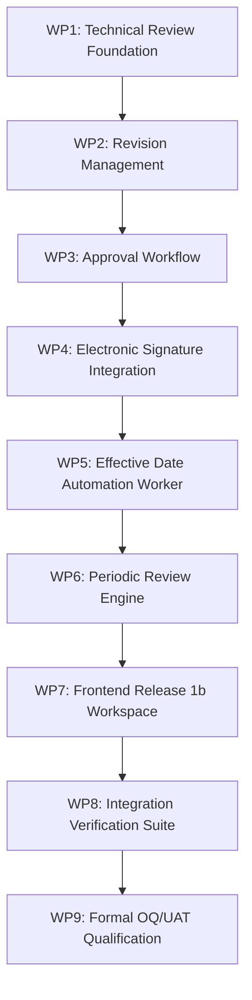

# Release 1b Implementation Plan

**Document ID:** ML-DC-R1B-IP-001  
**Version:** 1.0  
**Status:** Approved Implementation Plan  
**Module:** Document Control (Release 1b)  
**System:** MicroLIMS Enterprise Laboratory Information Management System  
**Authoritative Baseline:** MicroLIMS Document Control URS v1.1, FRS ML-DC-FRS-1B-001, RTM ML-DC-RTM-1B-001  
**Execution Model:** Controlled GAMP 5 Phase-Gated Work Packages (WP1 through WP9)  
**Date:** September 3, 2026  

---

## 1. Plan Overview & Execution Principles

This Implementation Plan defines the sequential, risk-controlled work breakdown structure for **Release 1b** of the MicroLIMS Document Control module.

### Core Implementation Principles:
1. **Release 1a Preservation:** Release 1a persistence, triggers, and services remain completely functional and regression-tested at each work package gate.
2. **Clean Architecture Isolation:** Domain entities have zero external dependencies; application services enforce all business invariants and SoD rules; controllers and frontend components remain thin.
3. **Hard Server-Side Segregation of Duties:** The rule **Author ≠ Reviewer ≠ Approver** is enforced at the service boundary with explicit negative tests.
4. **No Code Before Approval:** Implementation begins strictly after formal review and approval of this planning package.

---

## 2. Work Package Breakdown Structure

---

### Work Package 1 (WP1) — Technical Review Foundation
- **Objective:** Establish the database schema, domain entities, and application service logic for controlled technical review workflows.
- **Scope:**
  - Entities: `DocumentReviewTask`, `DocumentReviewFinding`.
  - Service: `IDocumentReviewService`, `DocumentReviewService`.
  - Findings comment lifecycle: `Open` -> `AuthorResponded` -> `ReviewerVerified` -> `Resolved`.
  - Mandatory comment gate: Blocks review completion while mandatory comments remain unresolved.
  - Reviewer concurrence gate: Authors prohibited from closing reviewer findings.
- **Dependencies:** Release 1a `DocumentRevision` and `DocumentMasterAssignment`.
- **Files Affected:**
  - `backend/MicroLIMS.Domain/Entities/DocumentReviewTask.cs` (New)
  - `backend/MicroLIMS.Domain/Entities/DocumentReviewFinding.cs` (New)
  - `backend/MicroLIMS.Domain/Enums/ReviewFindingStatus.cs` (New)
  - `backend/MicroLIMS.Domain/Enums/ReviewDecision.cs` (New)
  - `backend/MicroLIMS.Persistence/Configurations/DocumentReviewTaskConfiguration.cs` (New)
  - `backend/MicroLIMS.Persistence/Configurations/DocumentReviewFindingConfiguration.cs` (New)
  - `backend/MicroLIMS.Application/Interfaces/DocumentControl/IDocumentReviewService.cs` (New)
  - `backend/MicroLIMS.Application/Services/DocumentControl/DocumentReviewService.cs` (New)
  - `backend/MicroLIMS.API/Controllers/DocumentControl/DocumentReviewController.cs` (New)
- **Database Changes:** Migration creating tables `"DocumentReviewTasks"` and `"DocumentReviewFindings"` with foreign keys (`DeleteBehavior.Restrict`).
- **API Changes:** `POST /api/document-control/revisions/{id}/submit-review`, `POST /api/document-control/reviews/{id}/comments`, `PUT /api/document-control/comments/{id}/status`, `POST /api/document-control/reviews/{id}/decide`.
- **Audit Impact:** Captures `RevisionSubmittedForReview`, `ReviewCommentAdded`, `ReviewCommentStatusChanged`, `TechnicalReviewCompleted`, `TechnicalReviewReturned`.
- **Authorization & SoD:** Enforces **Author != Reviewer**; only assigned reviewer can close findings and complete review.
- **Testing Requirements:** Unit tests for review state machine, negative tests proving author cannot close comments, and gate tests proving mandatory comments block completion.
- **Acceptance Criteria:** Revision transitions to `InReview`; comments follow full lifecycle; completion blocked if open comments exist.
- **Rollback Considerations:** Drop tables `"DocumentReviewFindings"` and `"DocumentReviewTasks"` via down migration.

---

### Work Package 2 (WP2) — Revision Management
- **Objective:** Implement controlled creation and incrementation of revisions from effective documents, structured change items, and multi-category impact assessment.
- **Scope:**
  - Revision incrementation algorithm (Major `02`, Minor `01.1`) with authorized Document Controller override.
  - Entities: `RevisionChangeItem`, `RevisionImpactAssessment`.
  - Mandatory reason, change summary, and change reference (Change Control).
  - Continuous availability guard ensuring effective revision remains available while proposed revision is in draft.
- **Dependencies:** WP1; Release 1a `DocumentMasterService`.
- **Files Affected:**
  - `backend/MicroLIMS.Domain/Entities/RevisionChangeItem.cs` (New)
  - `backend/MicroLIMS.Domain/Entities/RevisionImpactAssessment.cs` (New)
  - `backend/MicroLIMS.Application/Interfaces/DocumentControl/IDocumentRevisionService.cs` (New)
  - `backend/MicroLIMS.Application/Services/DocumentControl/DocumentRevisionService.cs` (New)
  - `backend/MicroLIMS.API/Controllers/DocumentControl/DocumentRevisionController.cs` (New)
- **Database Changes:** Migration creating tables `"RevisionChangeItems"` and `"RevisionImpactAssessments"`.
- **API Changes:** `POST /api/document-control/documents/{id}/revisions`, `POST/PUT /api/document-control/revisions/{id}/changes`, `POST/GET /api/document-control/revisions/{id}/impact`.
- **Audit Impact:** Captures `DocumentRevisionCreated`, `RevisionChangeItemAdded`, `RevisionImpactAssessmentSaved`, `RevisionNumberOverridden`.
- **Authorization & SoD:** Restricted to Document Owner, assigned Author, or Document Controller.
- **Testing Requirements:** Sequence calculation tests, major/minor incrementation tests, override audit tests, impact assessment validation tests.
- **Acceptance Criteria:** New draft revision created without mutating or unpublishing the current effective revision.

---

### Work Package 3 (WP3) — Approval Workflow
- **Objective:** Implement formal approval routing, approver inspection dossier aggregation, and decision handling (`Approve`, `ReturnForCorrection`, `Decline`).
- **Scope:**
  - Entity: `DocumentApprovalTask`.
  - Approver dossier compilation (controlled PDF stream, change summary, impact assessment, review comments thread).
  - Reverting to `Draft` on `ReturnForCorrection`; cancelling/declining on `Decline`.
- **Dependencies:** WP1, WP2; Release 1a `DocumentAuthorizationService`.
- **Files Affected:**
  - `backend/MicroLIMS.Domain/Entities/DocumentApprovalTask.cs` (New)
  - `backend/MicroLIMS.Domain/Enums/ApprovalDecision.cs` (New)
  - `backend/MicroLIMS.Application/Interfaces/DocumentControl/IDocumentApprovalService.cs` (New)
  - `backend/MicroLIMS.Application/Services/DocumentControl/DocumentApprovalService.cs` (New)
  - `backend/MicroLIMS.API/Controllers/DocumentControl/DocumentApprovalController.cs` (New)
- **Database Changes:** Migration creating table `"DocumentApprovalTasks"`.
- **API Changes:** `GET /api/document-control/approvals/{id}/dossier`, `POST /api/document-control/approvals/{id}/decide`.
- **Audit Impact:** Captures `RevisionApprovalInitiated`, `RevisionReturnedByApprover`, `RevisionDeclinedByApprover`.
- **Authorization & SoD:** Must hold `Approver` role; hard guard: **Approver != Author** and **Approver != Reviewer**.
- **Testing Requirements:** Dossier compilation tests, return-to-draft regression tests, SoD negative tests.
- **Acceptance Criteria:** Approver receives compiled dossier; decisions transition revision to appropriate state.

---

### Work Package 4 (WP4) — 21 CFR Part 11 Electronic Signature Integration
- **Objective:** Integrate the existing qualified `ElectronicSignatureService` to bind authenticated electronic signatures directly to document approvals.
- **Scope:**
  - Password re-authentication using BCrypt.
  - Immutably recording signature row in `"ElectronicSignatures"` with `EntityType = "DocumentRevision"`.
  - Capturing user name snapshot, username, role, UTC timestamp, client IP, and signature meaning (`Approved`).
  - Effective date routing: If `EffectiveDate <= Today`, transition to `Effective`; if `EffectiveDate > Today`, transition to `FutureEffective`.
- **Dependencies:** WP3; Release 1a `IElectronicSignatureService`.
- **Files Affected:**
  - `backend/MicroLIMS.Application/Services/DocumentControl/DocumentApprovalService.cs` (Extension)
  - `backend/MicroLIMS.Application/DTOs/DocumentControl/ApproveRevisionWithSignatureRequest.cs` (New)
- **Database Changes:** None. Directly reuses existing qualified `"ElectronicSignatures"` table and `trg_electronicsignatures_immutable` trigger.
- **API Changes:** `POST /api/document-control/approvals/{id}/sign`.
- **Audit Impact:** Captures `DocumentRevisionApproved` and writes relational `ElectronicSignature` record.
- **Authorization & SoD:** Re-authentication strictly enforced; signer must be designated Approver; SoD enforced against Author and Reviewer.
- **Testing Requirements:** Valid password sign-off test, incorrect password rejection test, immutable snapshot verification, SoD violation test.
- **Acceptance Criteria:** Revision cannot be approved without successful password re-entry; immutable signature row created.

---

### Work Package 5 (WP5) — Effective Date Automation Worker
- **Objective:** Develop an idempotent, recoverable, UTC-clock driven background worker service to automate lifecycle transitions.
- **Scope:**
  - Transitioning approved `FutureEffective` revisions to `Effective` upon reaching their effective date.
  - Automatically setting prior effective revision to `Superseded` in the same database transaction.
  - Attributing audit logs to `ActorType.System`.
  - Downtime recovery catch-up and logging delayed executions.
  - Idempotent execution (running multiple times produces zero duplicates).
- **Dependencies:** WP4; Release 1a `IAuditEventService`.
- **Files Affected:**
  - `backend/MicroLIMS.Infrastructure/BackgroundServices/DocumentEffectiveDateWorker.cs` (New)
  - `backend/MicroLIMS.Application/Interfaces/DocumentControl/IDocumentLifecycleAutomationService.cs` (New)
  - `backend/MicroLIMS.Application/Services/DocumentControl/DocumentLifecycleAutomationService.cs` (New)
  - `backend/MicroLIMS.API/Program.cs` (Registration as `IHostedService`)
- **Database Changes:** None.
- **API Changes:** Internal service only; optional admin diagnostics endpoint: `GET /api/document-control/automation/status`.
- **Audit Impact:** Captures `RevisionAutomaticallyActivated`, `RevisionAutomaticallySuperseded` with `ActorType = ActorType.System`.
- **Testing Requirements:** Automated unit & integration tests simulating future date maturation, simultaneous supersession in single transaction, downtime recovery, and repeated idempotent runs.
- **Acceptance Criteria:** Revisions transition on schedule; downtime caught up upon restart; audit trail fully attributed to System.

---

### Work Package 6 (WP6) — Periodic Review Engine
- **Objective:** Implement the complete periodic review engine, task scheduling, outcome processing, and finding transfers.
- **Scope:**
  - Automated creation of `PeriodicReviewTask` records when `NextReviewDate <= UtcNow.AddDays(30)`.
  - Periodic review workspace endpoints and finding management.
  - Outcome processing:
    - `RemainsValid`: Advances `NextReviewDate = CompletedAt.AddMonths(Cycle)` without creating a new revision.
    - `RevisionRequired`: Unlocks revision creation with finding transfer.
    - `ObsolescenceRecommended`: Routes to obsolescence approval.
  - Dashboard overdue detection.
- **Dependencies:** WP5; Release 1a `DocumentRevision`.
- **Files Affected:**
  - `backend/MicroLIMS.Domain/Entities/PeriodicReviewTask.cs` (New)
  - `backend/MicroLIMS.Domain/Entities/PeriodicReviewFinding.cs` (New)
  - `backend/MicroLIMS.Domain/Enums/PeriodicReviewOutcome.cs` (New)
  - `backend/MicroLIMS.Persistence/Configurations/PeriodicReviewTaskConfiguration.cs` (New)
  - `backend/MicroLIMS.Persistence/Configurations/PeriodicReviewFindingConfiguration.cs` (New)
  - `backend/MicroLIMS.Application/Interfaces/DocumentControl/IPeriodicReviewService.cs` (New)
  - `backend/MicroLIMS.Application/Services/DocumentControl/PeriodicReviewService.cs` (New)
  - `backend/MicroLIMS.API/Controllers/DocumentControl/PeriodicReviewController.cs` (New)
- **Database Changes:** Migration creating tables `"PeriodicReviewTasks"` and `"PeriodicReviewFindings"`.
- **API Changes:** `GET /api/document-control/reviews/tasks`, `GET /api/document-control/reviews/{id}`, `POST /api/document-control/reviews/{id}/findings`, `POST /api/document-control/reviews/{id}/complete`.
- **Audit Impact:** Captures `PeriodicReviewTaskCreated`, `PeriodicReviewCompleted`, `NextReviewDateAdvanced`.
- **Testing Requirements:** Automated scheduling tests, outcome branching tests, review date recalculation tests, overdue filter tests.
- **Acceptance Criteria:** Tasks generated automatically; `RemainsValid` advances review date with zero revision count change.

---

### Work Package 7 (WP7) — Frontend Release 1b Workspace
- **Objective:** Implement the user-facing workspaces for Technical Review, Approver Dossier, Electronic Signature Dialog, and Periodic Review Management.
- **Scope:**
  - **Technical Review Workspace:** Dual side-by-side PDF comparison viewer, review findings drawer, author response editor, concurrence badge.
  - **Approval Workspace & Dossier:** Evidence dossier viewer, approval checklist, and Part 11 Electronic Signature dialog (username, password, meaning).
  - **Revision Management UI:** Create Revision dialog with major/minor selection, structured change items editor, and multi-category impact assessment checklist.
  - **Periodic Review Workspace:** Review task list, PDF inspection, findings editor, and outcome selection modal.
  - **Document Details Tabs Extension:** Add "Review Tasks" and "Periodic Reviews" tabs to existing `DocumentDetailPage`.
- **Dependencies:** WP1 through WP6; Release 1a Frontend components.
- **Files Affected:**
  - `frontend/src/modules/documentControl/pages/TechnicalReviewPage.tsx` (New)
  - `frontend/src/modules/documentControl/pages/ApprovalWorkspacePage.tsx` (New)
  - `frontend/src/modules/documentControl/pages/PeriodicReviewPage.tsx` (New)
  - `frontend/src/modules/documentControl/components/SideBySidePdfViewer.tsx` (New)
  - `frontend/src/modules/documentControl/components/ElectronicSignatureDialog.tsx` (New)
  - `frontend/src/modules/documentControl/components/CreateRevisionDialog.tsx` (New)
  - `frontend/src/modules/documentControl/components/ImpactAssessmentDialog.tsx` (New)
  - `frontend/src/modules/documentControl/pages/DocumentDetailPage.tsx` (Controlled Tab Extension)
  - `frontend/src/modules/documentControl/services/documentReviewService.ts` (New)
  - `frontend/src/modules/documentControl/services/periodicReviewService.ts` (New)
  - `frontend/src/routes/routes.ts` & `menuConfig.ts` (Route additions)
- **UI Changes:** Professional, document-centered MUI layouts matching existing MicroLIMS design tokens.
- **Testing Requirements:** Component unit tests, form validation tests, password entry modal tests, TypeScript type checking (`tsc -b`).
- **Acceptance Criteria:** Clean Vite build (0 errors); intuitive side-by-side comparison; electronic signature dialog securely transmits credentials over HTTPS.

---

### Work Package 8 (WP8) — Integration Verification Suite
- **Objective:** Construct and execute an exhaustive, automated PostgreSQL integration verification test suite covering all 43 Release 1b requirements.
- **Scope:**
  - End-to-end integration tests in `MicroLIMS.Tests/IntegrationTests/DocumentControlRelease1bPostgresTests.cs`.
  - Negative SoD integration tests proving Author cannot review or approve, and Reviewer cannot approve.
  - Part 11 signature verification against real database and BCrypt hasher.
  - Automation worker background loop tests simulating effective date activation, supersession, downtime catch-up, and idempotency.
  - Full solution regression test run (ensuring Release 1a tests remain 100% green).
- **Dependencies:** WP1 through WP7.
- **Testing Requirements:** 100% test execution pass rate across both Release 1a and Release 1b suites.
- **Acceptance Criteria:** All automated integration tests pass against live PostgreSQL with zero failures.

---

### Work Package 9 (WP9) — Formal OQ/UAT Qualification
- **Objective:** Execute the formal Operational Qualification (OQ) and User Acceptance Testing (UAT) protocol and produce the Release 1b Completion Report.
- **Scope:**
  - Execute OQ test cases (OQ-1B-01 through OQ-1B-28).
  - Execute realistic laboratory UAT scenarios (UAT-1B-01 through UAT-1B-08).
  - Complete formal traceability verification in RTM.
  - Author `WP5_Completion_Report.md` through `WP9_Completion_Report.md` and `Release_1b_Validation_Summary_Report.md`.
- **Dependencies:** WP8.
- **Acceptance Criteria:** 100% OQ/UAT pass rate; formal quality sign-offs recorded.

---

## 3. Rollback & Contingency Strategy

1. **Database Rollback:** Every migration created in WP1, WP2, WP3, and WP6 will include a validated `Down()` method capable of completely dropping new tables without affecting Release 1a tables (`"DocumentMasters"`, `"DocumentRevisions"`, `"RevisionFiles"`, `"AuditLogs"`, `"ElectronicSignatures"`).
2. **Feature Isolation:** New API controllers and routes are mounted under separate endpoints (`/reviews`, `/approvals`, `/periodic-reviews`), allowing them to be disabled via route configuration without affecting the core Document Library or Document Master endpoints.
3. **Automated Worker Circuit Breaker:** The `DocumentEffectiveDateWorker` includes a configuration setting `DocumentControl.Automation.WorkerEnabled` (default `true`). In the event of an unexpected scheduler anomaly, the worker can be paused instantly via database configuration setting without stopping the web application.
