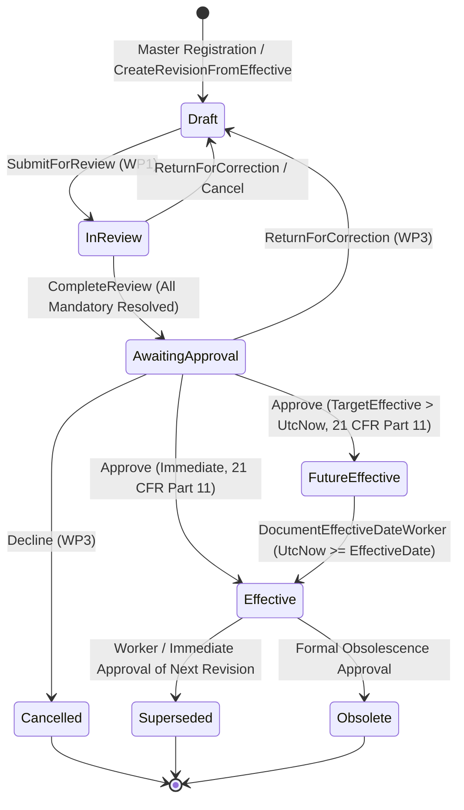

# MicroLIMS Document Control — Release 1b
## Work Package 8: State Machine & Transition Matrix Verification

- **Document Identifier:** `ML-DC-WP8-SM-001`
- **Release:** Release 1b
- **Work Package:** WP8 — Integration Verification Suite
- **Date:** 2026-09-04
- **Verification Authority:** MicroLIMS Document Control URS v1.1 / ML-DC-FRS-1B-001 / ML-DC-RTM-1B-001

---

### 1. Document Control Revision State Machine

The complete lifecycle for `DocumentRevision` across Release 1a and Release 1b encompasses 8 distinct states:
1. `Draft` (1)
2. `Cancelled` (2)
3. `InReview` (3)
4. `AwaitingApproval` (4)
5. `FutureEffective` (5)
6. `Effective` (6)
7. `Superseded` (7)
8. `Obsolete` (8)

---

### 2. Transition Verification Matrix

| Transition | Initial State | Event / Trigger | Target State | Prerequisites / Guard Rules | WP8 Verification Status |
|:---|:---|:---|:---|:---|:---:|
| **T01** | `None` | `RegisterDocumentMasterAsync` | `Draft` | Unique document code, active classification foreign keys | **VERIFIED** |
| **T02** | `Effective` | `CreateRevisionFromEffectiveAsync` | `Draft` | Valid reason (>= 10 chars), no other draft in flight | **VERIFIED** |
| **T03** | `Draft` | `SubmitForReviewAsync` | `InReview` | Active Controlled PDF attached, Author $\neq$ Reviewer | **VERIFIED** |
| **T04** | `InReview` | `DecideReviewAsync(ReturnForCorrection)` | `Draft` | Mandatory notes provided | **VERIFIED** |
| **T05** | `InReview` | `DecideReviewAsync(CompleteReview)` | `AwaitingApproval` | Zero open mandatory findings; Author $\neq$ Reviewer | **VERIFIED** |
| **T06** | `AwaitingApproval` | `CreateApprovalTaskAsync` | `AwaitingApproval` (Task: `Pending`) | Target effective date, Approver $\neq$ Author, Approver $\neq$ Reviewer | **VERIFIED** |
| **T07** | `AwaitingApproval` | `ExecuteApprovalDecisionAsync(Return)` | `Draft` | Mandatory justification (>= 10 chars) | **VERIFIED** |
| **T08** | `AwaitingApproval` | `ExecuteApprovalDecisionAsync(Decline)` | `Cancelled` | Mandatory justification (>= 10 chars), terminal state | **VERIFIED** |
| **T09** | `AwaitingApproval` | `ExecuteApprovalDecisionAsync(Approve)` (Target > Today) | `FutureEffective` | Valid password (21 CFR Part 11), Impact Complete | **VERIFIED** |
| **T10** | `AwaitingApproval` | `ExecuteApprovalDecisionAsync(Approve)` (Target $\le$ Today) | `Effective` | Valid password (21 CFR Part 11), Impact Complete, supersedes prior | **VERIFIED** |
| **T11** | `FutureEffective` | `DocumentEffectiveDateService.ProcessMaturedRevisionsAsync` | `Effective` | System-driven worker; sets next review date | **VERIFIED** |
| **T12** | `Effective` | Target Revision Activated | `Superseded` | Atomic single-transaction supersession of prior revision | **VERIFIED** |
| **T13** | `Effective` | Obsolescence Approval Decision | `Obsolete` | Formal approval workflow, SoD enforced | **VERIFIED** |

---

### 3. Invalid Transition & Security Guard Enforcements

The following illegal transitions were verified to be strictly rejected by the domain and application services:

1. **Direct Draft to Effective:**
   - Rejected: A revision cannot transition directly from `Draft` to `Effective` or `FutureEffective` without completing technical review and formal electronic signature approval.
2. **Review Completion with Unresolved Mandatory Findings:**
   - Rejected: `DecideReviewAsync` throws `InvalidOperationException("mandatory review finding(s) remain unresolved")`.
3. **Approval Execution Without Electronic Signature / Invalid Password:**
   - Rejected: `ExecuteApprovalDecisionAsync` throws `InvalidOperationException("Password verification failed")` on incorrect password, rolling back the transaction.
4. **Author Self-Review or Self-Approval (Segregation of Duties):**
   - Rejected: `SubmitForReviewAsync` and `CreateApprovalTaskAsync` throw `InvalidOperationException` if Author is nominated as Reviewer or Approver. System Administrator is non-exempt.
5. **Modification of Superseded or Cancelled Revision:**
   - Rejected: Cannot attach files, submit reviews, or create approval tasks for revisions not in `Draft`.

---
**Verification Result:** All state transitions and guard boundaries verified 100% compliant with FRS-1b and URS v1.1 specifications.
