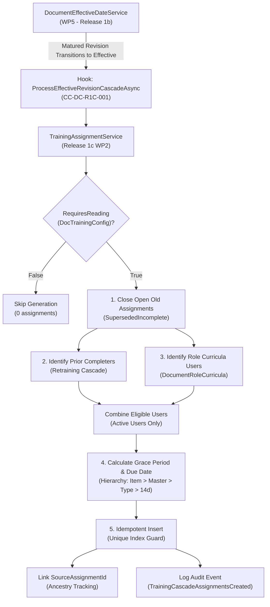

# Release 1c Work Package 2 (WP2) Completion Report
## Assignment Engine & Retraining Cascade Implementation & Verification

- **Document ID:** `ML-DC-R1C-WP2-001`
- **Release:** Release 1c (Training Matrix & Reading Lists)
- **Work Package:** WP2 — Assignment Engine & Retraining Cascade
- **Date:** September 4, 2026
- **Status:** **IMPLEMENTED / VERIFIED / TESTED / REGRESSION GREEN**
- **Controlled Change Record:** `CC-DC-R1C-001`
- **Authoritative Traceability Baseline:** `ML-DC-RTM-1C-001` v1.2

---

### 1. Executive Summary

Work Package 2 (WP2) has implemented the core reading assignment generation, role curriculum evaluation, due date / grace period calculation, automated retraining cascade, terminal closure of open assignments on superseded revisions, and obsolescence cancellation workflows mandated for MicroLIMS Document Control Release 1c.

All WP2 components have been implemented in strict alignment with `ML-DC-FRS-1C-001`, verified via unit tests and PostgreSQL integration tests, and integrated non-intrusively into the existing Release 1b `DocumentEffectiveDateService` lifecycle hook under formal change control record `CC-DC-R1C-001`.

#### Key Execution Metrics
- **WP2 Requirements Implemented:** **12 of 35 (34.3%)**
  - `DC-URS-080`, `DC-URS-081`, `DC-URS-082`, `DC-URS-083`, `DC-URS-114`, `DC-URS-115`, `DC-URS-170`, `DC-URS-171`, `DC-URS-172`, `DC-URS-173`, `DC-URS-174`, `DC-URS-175`
- **New Unit Tests Added:** **12 passing tests** (`DocumentControlTrainingAssignmentEngineUnitTests`)
- **New PostgreSQL Integration Tests Added:** **3 passing tests** (`DocumentControlTrainingAssignmentEnginePostgresIntegrationTests`)
- **Total Backend Regression Suite:** **752 / 752 PASSING (100% GREEN)**
- **Frontend Build Status:** **CLEAN PASS (`tsc -b && vite build`)**
- **Production Baseline (Release 1b):** **PROTECTED AND UNMODIFIED**

---

### 2. Implemented Architecture & Components



#### 2.1 Component Inventory
1. **DTOs (`backend/MicroLIMS.Application/DTOs/DocumentControl/TrainingAssignmentDtos.cs`):**
   - `TrainingAssignmentGenerationResultDto`: Captures `TotalEligibleUsers`, `NewAssignmentsCreated`, `ExistingAssignmentsSkipped`, `SupersededAssignmentsClosed`, `CreatedAssignmentIds`, and `ErrorMessages`.
   - `ManualTrainingAssignmentRequest`: Strongly typed command for individual user assignments.
   - `BulkGroupAssignmentRequest`: Strongly typed command for role/department group assignments.

2. **Service Interface (`backend/MicroLIMS.Application/Interfaces/DocumentControl/ITrainingAssignmentService.cs`):**
   - `ProcessEffectiveRevisionCascadeAsync`: Automatic cascade upon revision activation.
   - `AssignToUsersAsync`: Manual assignment to specific users with custom grace period support.
   - `AssignToGroupAsync`: Role- and department-filtered assignment generation.
   - `HandleDocumentObsolescenceAsync`: Controlled terminal closure of open assignments upon document voiding/obsolescence.
   - `CalculateDueDateAsync`: Grace period resolution hierarchy.
   - `IsTrainedOnSupersededOnlyAsync`: Detection of personnel qualified on superseded revision only.

3. **Core Engine (`backend/MicroLIMS.Application/Services/DocumentControl/TrainingAssignmentService.cs`):**
   - Full transactional implementation with idempotency guarantees, active user filtering, ancestry retention, terminal status handling, and system-attributed audit logging.

4. **Integration Hook (`CC-DC-R1C-001`):**
   - Injected `ITrainingAssignmentService?` optionally into `DocumentEffectiveDateService`.
   - Executed after revision transaction commit with full failure isolation (`SystemProcessError` audit logging without compromising document revision state).
   - Registered in DI container via `ServiceCollectionExtensions.cs`.

---

### 3. Requirements Implementation Verification

| Requirement ID | Verification Summary | Test Implementation | Result |
|:---|:---|:---|:---:|
| **DC-URS-080** | Automatic generation of reading assignments upon revision activation | `ProcessEffectiveRevisionCascadeAsync_CurriculumDriven_GeneratesAssignmentsForActiveUsers` | **PASS** |
| **DC-URS-081** | Manual assignment to specific users with custom grace periods | `AssignToUsersAsync_ManuallyAssignsTargetUsers_WithCustomGracePeriod` | **PASS** |
| **DC-URS-082** | Role- and department-level bulk assignments | `AssignToGroupAsync_AssignsAllActiveUsersInRole` | **PASS** |
| **DC-URS-083** | Grace period hierarchy (Curriculum Item > Master Config > DocType Config > 14 days) | `ProcessEffectiveRevisionCascadeAsync_HonorsCurriculumItemCustomGracePeriod` | **PASS** |
| **DC-URS-114** | Identification of personnel trained only on superseded revision | `IsTrainedOnSupersededOnlyAsync_ReturnsTrueOnlyWhenQualifiedOnSupersededRevision` | **PASS** |
| **DC-URS-115** | Role-based required training curricula assignment engine | `ProcessEffectiveRevisionCascadeAsync_CurriculumDriven_GeneratesAssignmentsForActiveUsers` | **PASS** |
| **DC-URS-170** | Retraining cascade automatically triggered when revision transitions to Effective | `ProcessEffectiveRevisionCascadeAsync_RetrainingCascade_LinksSourceAndClosesOpenOldAssignments` | **PASS** |
| **DC-URS-171** | Retraining rules configurable at master and document type levels | `ProcessEffectiveRevisionCascadeAsync_WhenRequiresReadingFalse_ProducesZeroAssignments` | **PASS** |
| **DC-URS-172** | Open assignments on superseded revision terminally closed as `SupersededIncomplete` | `ProcessEffectiveRevisionCascadeAsync_RetrainingCascade_LinksSourceAndClosesOpenOldAssignments` | **PASS** |
| **DC-URS-173** | Completed assignments on superseded revision remain permanently immutable | `ProcessEffectiveRevisionCascadeAsync_RetrainingCascade_LinksSourceAndClosesOpenOldAssignments` | **PASS** |
| **DC-URS-174** | Superseded-only training query evaluates $R_N$ vs $R_{prior}$ completions | `IsTrainedOnSupersededOnlyAsync_ReturnsTrueOnlyWhenQualifiedOnSupersededRevision` | **PASS** |
| **DC-URS-175** | Document obsolescence cancels open assignments as `Cancelled` | `HandleDocumentObsolescenceAsync_CancelsOpenAssignmentsAndIgnoresCompleted` | **PASS** |

---

### 4. Controlled Change & Safety Verification (`CC-DC-R1C-001`)

1. **Non-Breaking Extension:**
   - `DocumentEffectiveDateService` accepts `ITrainingAssignmentService?` as an optional parameter with default `null`.
   - Existing unit tests for `DocumentEffectiveDateService` continue to pass without modification.
2. **Failure Isolation:**
   - Verified via unit test `DocumentEffectiveDateService_FailureIsolation_LogsAuditAndDoesNotRollbackCommittedRevision`.
   - In the event of a training service fault, the committed document transition remains valid, and a `SystemProcessError` audit event is recorded.
3. **Idempotency & Race Condition Prevention:**
   - In-memory test `ProcessEffectiveRevisionCascadeAsync_Idempotent_PreventsDuplicateAssignments` verified that repeated calls produce zero duplicates and correctly increment `ExistingAssignmentsSkipped`.
   - PostgreSQL integration test `Postgres_UniqueIndex_EnforcesSingleAssignmentPerUserRevisionAndType` verified that duplicate inserts violate the composite unique index `IX_DocumentTrainingAssignments_DocumentRevisionId_AssignedUserId_AssignmentType`.

---

### 5. Regression & Build Evidence

#### Backend Regression
```text
Test run for MicroLIMS.Tests.dll (.NETCoreApp,Version=v8.0)
A total of 1 test files matched the specified pattern.
Passed!  - Failed: 0, Passed: 752, Skipped: 0, Total: 752, Duration: 53 s
```

#### Frontend Verification
```text
> microlims-frontend@0.1.0 build
> tsc -b && vite build

vite v5.4.21 building for production...
transforming...
✓ 2397 modules transformed.
rendering chunks...
dist/index.html                    1.71 kB │ gzip:   0.73 kB
dist/assets/index-BJP3wpKa.js  2,480.89 kB │ gzip: 634.50 kB
✓ built in 22.83s
```

---

### 6. Scope Boundaries & Next Work Package

In strict compliance with controlled execution governance:
- **WP2 Scope Complete:** Assignment Engine & Retraining Cascade is fully implemented and verified.
- **WP3 Acknowledgement Engine:** Has NOT started.
- **WP4 Escalation & Overdue Engine:** Has NOT started.
- **WP5 REST API Endpoints:** Has NOT started.
- **WP6 "My Reading List" UI:** Has NOT started.
- **WP7 "Training Matrix" UI:** Has NOT started.
- **WP8/WP9 Verification & Qualification:** Has NOT started.

---

### 7. Authoritative Work Package Closing Statement

> **Release 1c WP2 Assignment Engine & Retraining Cascade is IMPLEMENTED / VERIFIED / TESTED / REGRESSION GREEN. Release 1b production baseline remains protected. Release 1c WP3 Acknowledgement Engine has not started.**
