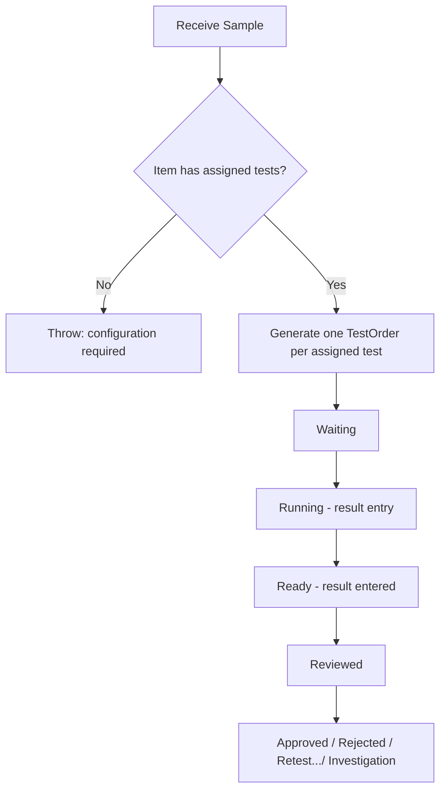
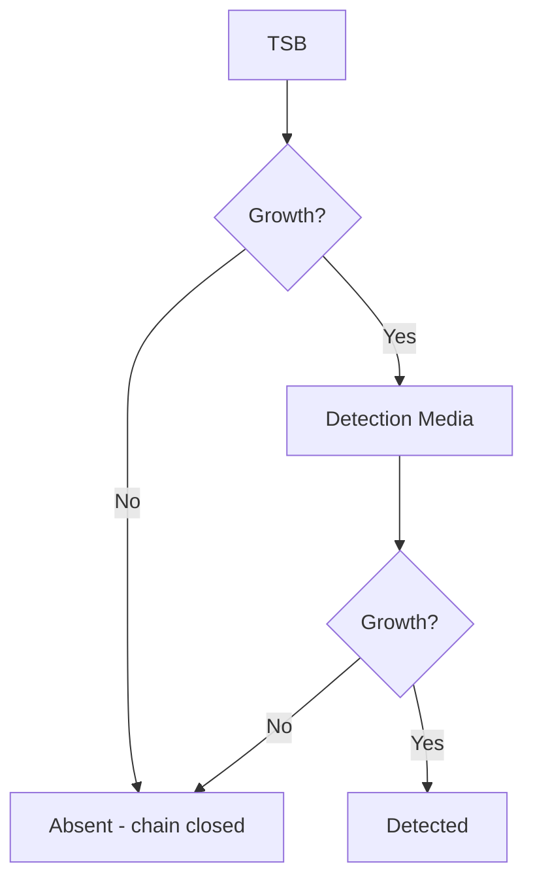
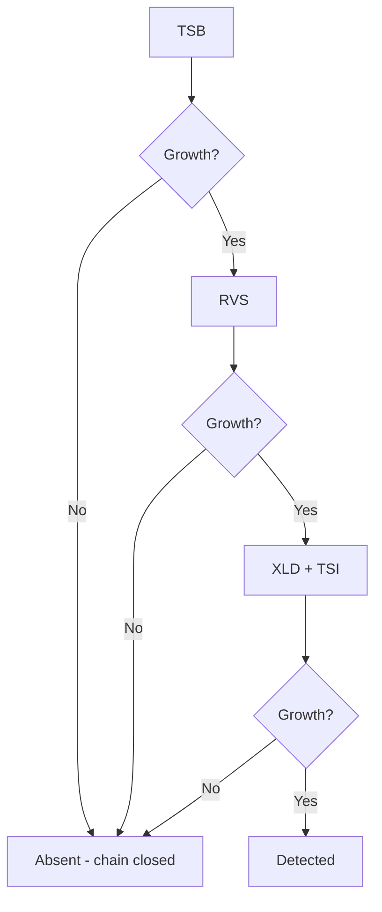
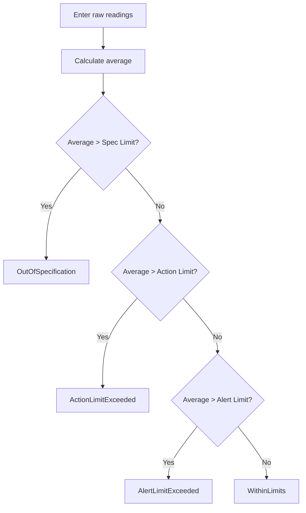
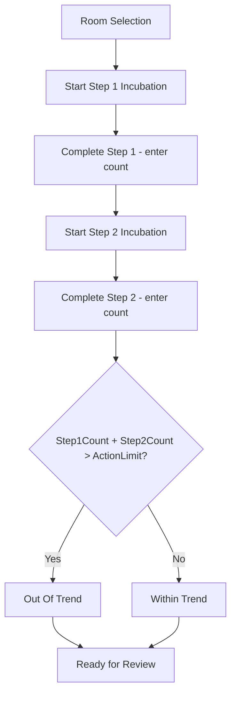
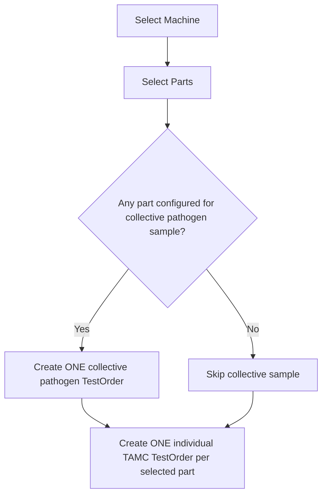
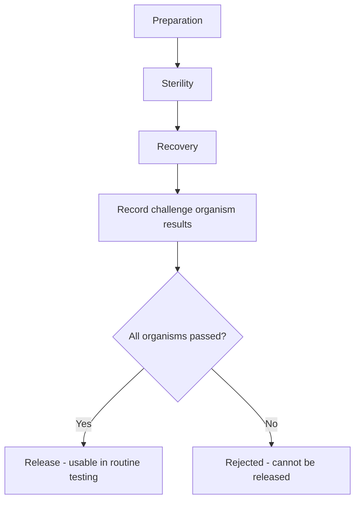
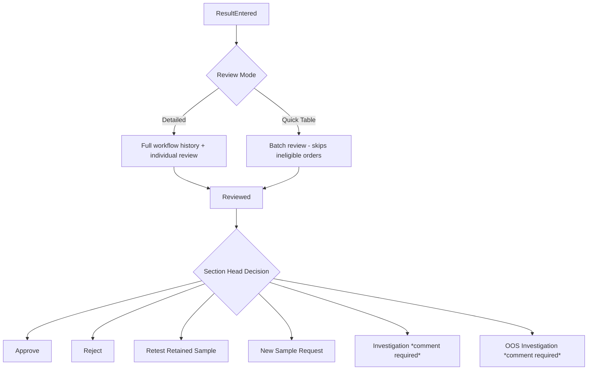

# MicroLIMS Workflow Diagrams

Companion to `BusinessRules.md` — same rules, visual form. Each diagram
matches its `*WorkflowEngine.cs` file exactly.

## Product Workflow

## Pathogen Engine — Universal Chain

## Pathogen Engine — Salmonella Exception

## Water Calculation Engine

## EM (Environmental Monitoring) Engine

## After Cleaning Engine

## GPT (Growth Promotion Test) Engine

## Review → Approval (shared across all domains)

